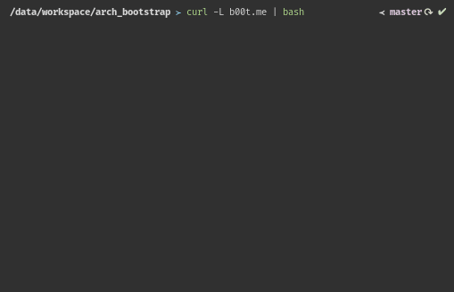

# Arch Bootstrap

This script is used to automate the customization/bootstrapping of your Arch installation. This includes installing packages and running custom scripts to set up your environment.



&nbsp;&nbsp;

## Usage

Simply run the following command on your newly installed Arch environment to start the bootstrapping process.

```
curl -L b00t.me | bash
```

The script by default points to the config file located at the address http://config.b00t.me but can be changed to any local or remote file during installation.

&nbsp;&nbsp;

## Config

The config file is split up in sections which is represented in the GUI dialogs of the script as seen in the above capture, followed by any custom commands that are called from the menu entries.

For example:

```
=Utilities
P,openssh,enable-sshd

=Desktop Environment
P,bspwm sxhkd,,bspwm window manager
A,polybar

=CMD enable-sshd: sudo systemctl enable sshd
```

### Syntax

A section starts with `=Secion_name` and contain menu entries formatted in a comma separated line:

```
=Secion_name
tag, package name(s), custom command name, description`
```

The syntax for menu entries are as follows:

```
1. Tag
- P: packages are from official repository
- A: packages are from user repository (AUR) and are installed using the `yay` package manager
2. Name
- Package name(s) to install, separated by a space
3. Command name
- Command to run as specified by the `=CMD <name>:` section
4. Description
- If description is specified, this will replace the default package name in the menu entry
```

Depending on the construction of the meny entry line, only the tag is manditory. Either package name or description needs to specified, and the command name is fully optional.

&nbsp;&nbsp;

Custom commands start with `CMD= <name>:` and have to be defined at the end of the config file **after** the menu sections.

The syntax for commands are:
```
=CMD command_name: <system commands to run>

Or for multiple commands:

=CMD command_name1
command1
command2
...

=CMD command_name2
command3
command4
```

&nbsp;&nbsp;

Please refer to the [config file](config) in this repository for more examples
